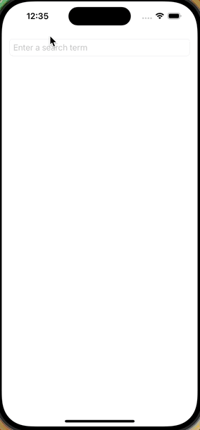

# Flickr Search Code Challenge
This code challenge allows a user to search the Flickr API for images, which will be displayed in a simple `List` on the main screen. Tapping on a row will navigate to a detail view for the specific image. Users can search for multiple tags by separating search terms with a comma.

## Requirements
- Xcode 15

## Running the App
1. Open the Xcode project
1. Wait for all packages to be downloaded
1. Run the app (Product --> Run -or- Cmd + R)

## Testing
There are a few unit tests included in the project. To run the unit tests:
1. Product --> Test (or Cmd + U)

## Demo

## Code Challenge Commentary
It was a conscious decision to include a little addional metadata in the main List after searching for images. I realize I could have used a grid and ONLY displayed the thumbnails, but since I am using a List component it made sense to add a bit of information to make it look a bit more approachable.

## Code Commentary
Since this is a time-boxed code challenge, I chose to make some technical decisions in favor of functionality to make sure the app hit all acceptance criteria. There are `TODO JEL`s in the code that call attention to most of these items. Before calling a feature complete, I would typically address all remaining TODOs.

### 3rd Party Dependencies
Part of the acceptance criteria required me to parse HTML to extract the image's width and height. In the interest of saving time, I chose to use a 3rd party (SwiftSoup) to do this for me. I included this dependency with Swift Package Manager.

## Known Issues
As I was testing, I found an issue with some bad data being sent back as I was searching for "house" If you search for "hou" there is at least one result with an invalid ISO8601 date for the `date_taken` parameter. The date string for parameter sent from the API is "-0001-11-30T00:00:00-08:00" The Swift `JSONDecoder` cannot parse this because it's not a valid date, and our code will `throw `.

To fix this issue I would do two things:
1. Make the `date_taken` parameter optional
1. Create a custom decoder on my `SearchItem` struct. If decoding the date failed, I would set the value to `nil`
1. I would make the same change to any other Date values (ie, `published`) just in case there is additional bad data.

## Future enhancements
Again due to the time contraints, I simply did not have enough time to build everything perfectly. The items listed here are enhancements (both technical and user-facing) that I would make given more time. In no particular order:
- Testing the network layer. I built the `SearchViewModel` so that you could inject your own `URLSession`. There are techniques where you can create your own `URLSessionConfiguration` and use that for testing that will allow you to return custom payloads for testing, rather that using `URLSession.shared` and hitting the actual network.
- Add the ability to "clear" search text rather than requiring a user to backspace to start over.
- Better error handling. Right now errors are simply printed to the console, which doesn't give the user any indication that something went wrong. It would be better to alert the user if there was an unrecoverable error.
- Add UI/Snapshot tests. Since there is no design, there was no reason to create reusable UI elements. If there were, I sometimes find it valuable to create snapshots tests of the components to make sure code changes don't affect the expected look at feel. Additionally, these tests could verify other reusable views (eg `SearchItemRowView`)
- `AsyncImage` loading phase errors. If there are problems loading image thumbnails, they aren't currently handled.
- `SearchItemDetails` view model. There is minimal logic and date formatting code that would be better served to be in a view model, separated from the view.
- Design. I am not a good designer :) I would not want to push this app to production without some nice UI changes. 
- Loading indicator when searching for images. It would enhance the user experience if they had feedback to indicate when the was app was fetching data. 
- Input sanitization. Right now we allow the user to search for anything, and if they choose to search for multiple tags we don't verify that they are separated by a comma.
- More accessibility testing. I'm using native SwiftUI controls so most things are handled okay with VoiceOver. One thing I might improve upon is some custom handling of the list of tags, or reading the description of a field like "author" or image size.
